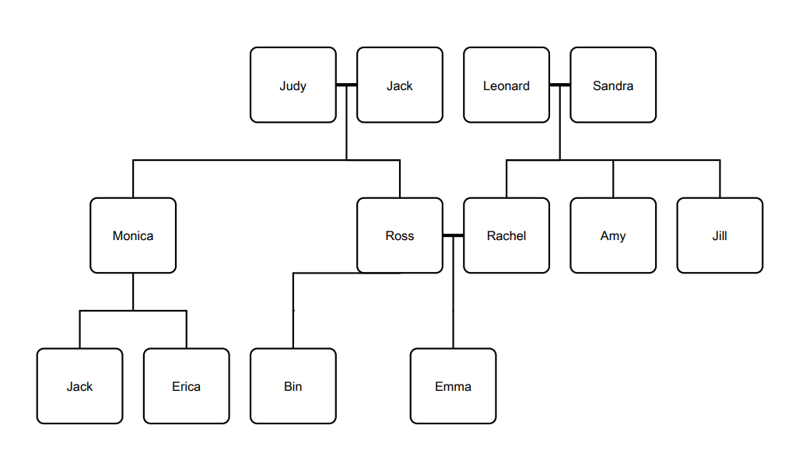

# get_page_example

 The new features to getx.

- [get_page_example](#get_page_example)
  - [GetPage Children](#getpage-children)
  - [GetPage Middleware](#getpage-middleware)
    - [Priority](#priority)
    - [Redirect](#redirect)
    - [onPageCalled](#onpagecalled)
    - [OnBindingsStart](#onbindingsstart)
    - [OnPageBuildStart](#onpagebuildstart)
    - [OnPageBuilt](#onpagebuilt)
    - [OnPageDispose](#onpagedispose)

## GetPage Children

lets say we have tow families:

    - The Greens
    - The Gellers

So the Family tree will be like this:



and with `GetPage` we can represent the Gellers tree like this.

```dart
   GetPage(
      name: '/gellers',
      page: () => GellersView(),
      binding: GellersBinding(),
    ),
    GetPage(
      name: '/gellers/jack',
      page: () => JackView(),
      binding: JackBinding(),
    ),
    GetPage(
      name: '/gellers/jack/monica',
      page: () => MonicaView(),
      binding: MonicaBinding(),
    ),
    GetPage(
      name: '/gellers/jack/monica/jackj',
      page: () => JackBingView(),
      binding: JackBingBinding(),
    ),
    GetPage(
      name: '/gellers/jack/monica/erica',
      page: () => EricaView(),
      binding: EricaBinding(),
    ),
    GetPage(
      name: '/gellers/jack/ross',
      page: () => RossView(),
      binding: RossBinding(),
    ),
    GetPage(
      name: '/gellers/jack/ross/bin',
      page: () => BenView(),
      binding: BenBinding(),
    ),
    GetPage(
      name: '/gellers/jack/ross/emma',
      page: () => EmmaView(),
      binding: EmmaBinding(),
    ),
    GetPage(
      name: '/gellers/judy',
      page: () => JudyView(),
      binding: JudyBinding(),
    ),
    GetPage(
      name: '/gellers/judy/monica',
      page: () => MonicaView(),
      binding: MonicaBinding(),
    ),
    GetPage(
      name: '/gellers/judy/monica/jackj',
      page: () => JackBingView(),
      binding: JackBingBinding(),
    ),
    GetPage(
      name: '/gellers/judy/monica/erica',
      page: () => EricaView(),
      binding: EricaBinding(),
    ),
    GetPage(
      name: '/gellers/judy/ross',
      page: () => RossView(),
      binding: RossBinding(),
    ),
    GetPage(
      name: '/gellers/judy/ross/bin',
      page: () => BenView(),
      binding: BenBinding(),
    ),
    GetPage(
      name: '/gellers/judy/ross/emma',
      page: () => EmmaView(),
      binding: EmmaBinding(),
    )
```

or with the new children feature

```dart
 GetPage(
      name: '/gellers',
      page: () => GellersView(),
      binding: GellersBinding(),
      children: [
        GetPage(
            name: '/jack',
            page: () => JackView(),
            binding: JackBinding(),
            children: [
              GetPage(
                  name: '/monica',
                  page: () => MonicaView(),
                  binding: MonicaBinding(),
                  children: [
                    GetPage(
                        name: '/jackj',
                        page: () => JackBingView(),
                        binding: JackBingBinding()),
                    GetPage(
                        name: '/erica',
                        page: () => EricaView(),
                        binding: EricaBinding())
                  ]),
              GetPage(
                  name: '/ross',
                  page: () => RossView(),
                  binding: RossBinding(),
                  children: [
                    GetPage(
                        name: '/bin',
                        page: () => BenView(),
                        binding: BenBinding()),
                    GetPage(
                        name: '/emma',
                        page: () => EmmaView(),
                        binding: EmmaBinding()),
                  ])
            ]),
        GetPage(
            name: '/judy',
            page: () => JudyView(),
            binding: JudyBinding(),
            children: [
              GetPage(
                  name: '/monica',
                  page: () => MonicaView(),
                  binding: MonicaBinding(),
                  children: [
                    GetPage(
                        name: '/jackj',
                        page: () => JackBingView(),
                        binding: JackBingBinding()),
                    GetPage(
                        name: '/erica',
                        page: () => EricaView(),
                        binding: EricaBinding())
                  ]),
              GetPage(
                  name: '/ross',
                  page: () => RossView(),
                  binding: RossBinding(),
                  children: [
                    GetPage(
                        name: '/bin',
                        page: () => BenView(),
                        binding: BenBinding()),
                    GetPage(
                        name: '/emma',
                        page: () => EmmaView(),
                        binding: EmmaBinding()),
                  ])
            ])
      ])
```
So with any small change on any father in the tree all children will be updated.

## GetPage Middleware

The GetPage has now new property that takes a list of GetMiddleWare and run them in the specific order.

**Note**: When GetPage has a Middlewares, all the children of this page will have the same middlewares automatically.

### Priority

The Order of the Middlewares to run can pe set by the priority in the GetMiddleware.

```dart
final middlewares = [
  GetMiddleware(priority: 2),
  GetMiddleware(priority: 5),
  GetMiddleware(priority: 4),
  GetMiddleware(priority: -8),
];
```
those middlewares will be run in this order **-8 => 2 => 4 => 5**

### Redirect

This function will be called when the page of the called route is being searched for. It takes RouteSettings as a result to redirect to. Or give it null and there will be no redirecting.

```dart
GetPage redirect( ) {
  final authService = Get.find<AuthService>();
  return authService.authed.value ? null : RouteSettings(name: '/login')
}
```

### onPageCalled

This function will be called when this Page is called before anything created
you can use it to change something about the page or give it new page

```dart
GetPage onPageCalled(GetPage page) {
  final authService = Get.find<AuthService>();
  return page.copyWith(title: 'Welcome ${authService.UserName}');
}
```

### OnBindingsStart

This function will be called right before the Bindings are initialize.
Here you can change Bindings for this page.

```dart
List<Bindings> onBindingsStart(List<Bindings> bindings) {
  final authService = Get.find<AuthService>();
  if (authService.isAdmin) {
    bindings.add(AdminBinding());
  }
  return bindings;
}
```

### OnPageBuildStart

This function will be called right after the Bindings are initialize.
Here you can do something after that you created the bindings and before creating the page widget.

```dart
GetPageBuilder onPageBuildStart(GetPageBuilder page) {
  print('bindings are ready');
  return page;
}
```

### OnPageBuilt

This function will be called right after the GetPage.page function is called and will give you the result of the function. and take the widget that will be showed.

### OnPageDispose

This function will be called right after disposing all the related objects (Controllers, views, ...) of the page.
